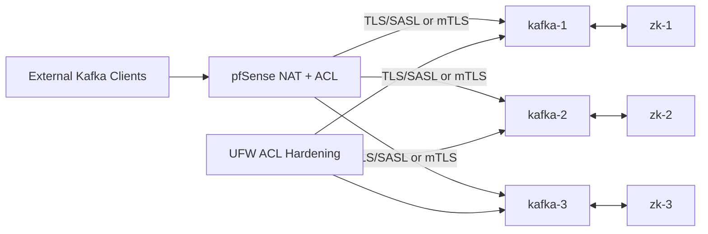
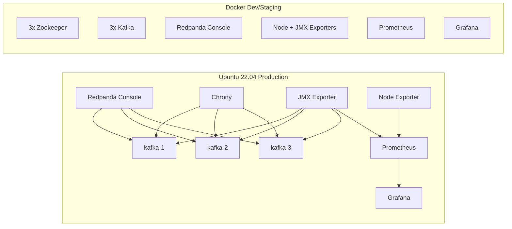

# Kafka Deployment Configuration (Ansible, Role-Based)

Comprehensive role-based Ansible project to deploy:

- **Production (Ubuntu 22.04)**: 3-node Kafka + 3-node Zookeeper with hardened security.
- **Development/Staging (Docker)**: equivalent multi-node stack for fast testing. See **[DOCKER_DEPLOYMENT_GUIDE.md](DOCKER_DEPLOYMENT_GUIDE.md)** for step-by-step instructions.
- **Operations tooling**: Redpanda Console, JMX exporter, Node exporter, Prometheus, Grafana, Chrony.
- **Network exposure model**: NAT-aware Kafka external listener with pfSense artifacts.
- **Scale-out support**: add brokers and rebalance partitions.

## Architecture Diagrams

### 1) Production traffic and security flow



This graph focuses on how production clients reach Kafka through pfSense, how brokers depend on ZooKeeper quorum, and where host-level firewall hardening applies.

### 2) Operations, observability, and dev/staging parity



This graph separates day-2 operations from traffic flow: admin tooling, metrics pipeline (JMX/Node exporter to Prometheus to Grafana), and the equivalent Docker stack used for pre-production testing.

## Why each non-Kafka component exists

- **Zookeeper**: Kafka metadata quorum for this ZooKeeper-based deployment model.
- **Chrony**: keeps cluster clocks aligned, preventing cert/auth/session issues and election instability.
- **Node Exporter**: host CPU/memory/disk/network visibility for capacity and incident response.
- **JMX Exporter**: exposes broker internals (ISR, request rates, JVM stats) for Kafka observability.
- **Redpanda Console**: operational UI for topics, consumers, and broker health checks.
- **pfSense NAT artifacts**: inventory-driven runbook/snippets for consistent external listener exposure.
- **Firewall ACL role (UFW)**: enforces least-privilege access per port/CIDR, reducing attack surface.
- **Kafka PKI role**: auto-generates cluster CA + broker certificates + JKS keystore/truststore.
- **Kafka security role**: applies TLS+SASL (or mTLS mode) and ACL authorizer settings.

## Security model for production

- **Supported modes**: `sasl_ssl` (default) or `mtls` via `kafka_security_mode`.
- **PKI automation**: `kafka_pki` generates shared CA, broker certs, keystore, truststore.
- **TLS stores required** on each broker:
  - `/etc/kafka/secrets/kafka.server.keystore.jks`
  - `/etc/kafka/secrets/kafka.server.truststore.jks`
- **SASL/PLAIN over TLS**:
  - JAAS file rendered to `/etc/kafka/kafka_server_jaas.conf`
  - inter-broker and client authentication enabled.
- **mTLS mode**:
  - listener protocol set to `SSL`
  - `ssl.client.auth=required`
- **ACL hardening**:
  - `authorizer.class.name=kafka.security.authorizer.AclAuthorizer`
  - `allow.everyone.if.no.acl.found=false`
  - `super.users` controlled by inventory vars.

## Repository layout

- `playbooks/prod.yml` - production install (includes `kafka_pki`, `kafka_security`, `firewall_acl`).
- `playbooks/docker.yml` - dockerized dev/staging stack.
- `playbooks/prod_monitoring.yml` - optional production Prometheus + Grafana deployment.
- `playbooks/scale_add_broker.yml` - serial broker scale-out.
- `roles/kafka_pki` - CA/certificate/keystore/truststore automation for brokers.
- `roles/kafka_security` - TLS/SASL or mTLS broker security config.
- `roles/firewall_acl` - host firewall ACL hardening with UFW.
- `roles/prometheus_grafana` - optional production monitoring stack role.
- `roles/*` - remaining infra, Kafka, Zookeeper, monitoring, console roles.
- `generated/` - pfSense NAT artifacts generated from inventory.

## Configure production inventory

Update host mappings in `inventories/prod/hosts.yml`, then tune security and ACL variables in `inventories/prod/group_vars/all.yml`:

- `kafka_pki_enabled: true|false`
- `kafka_security_mode: sasl_ssl` or `mtls`
- SASL identities/passwords (`kafka_sasl_*`)
- `kafka_ssl_*` keystore/truststore paths and passwords
- ACL source ranges (`firewall_admin_cidrs`, `firewall_kafka_client_cidrs`, etc.)

Optional monitoring host is provided in inventory as `monitoring-1` (group: `monitoring`).

## Deploy

Install collections:

```bash
ansible-galaxy collection install -r requirements.yml
```

Run production:

```bash
ansible-playbook -i inventories/prod/hosts.yml playbooks/prod.yml
```

Run docker dev/staging:

```bash
ansible-playbook -i inventories/docker/hosts.yml playbooks/docker.yml
```

Docker endpoints after deploy:

- Prometheus: `http://localhost:9090`
- Grafana: `http://localhost:3000` (default `admin/admin`)

## Scale out brokers

1. Add broker host with next `kafka_broker_id` in `inventories/prod/hosts.yml`.
1. Run scale playbook:

```bash
ansible-playbook -i inventories/prod/hosts.yml playbooks/scale_add_broker.yml
```

1. Generate reassignment plan:

```bash
chmod +x scripts/rebalance-topics.sh
BROKER_LIST="1,2,3,4" BOOTSTRAP="<broker>:9092" scripts/rebalance-topics.sh
```

## pfSense NAT artifacts

Production playbook generates:

- `generated/pfsense-nat-plan.md`
- `generated/pfsense-shellcmd.sh`

## Production monitoring walkthrough (Prometheus + Grafana)

1. Ensure `monitoring-1` host is reachable in `inventories/prod/hosts.yml`.
1. Keep `node_exporter` and `jmx_exporter` deployed on production nodes (already in `playbooks/prod.yml`).
1. Deploy optional monitoring stack:

```bash
ansible-playbook -i inventories/prod/hosts.yml playbooks/prod_monitoring.yml
```

1. Access services: Prometheus `http://<monitoring-host>:9090`, Grafana `http://<monitoring-host>:3000`.
1. In Grafana, add Prometheus datasource URL: `http://prometheus:9090`.
1. Import dashboard templates for Node Exporter and Kafka JMX metrics.
1. Restrict access with firewall CIDRs and change default Grafana credentials in group vars.

Runtime checks:

- Internal metadata: `kcat -b <private-broker-ip>:9092 -L`
- External metadata (through NAT): `kcat -b <public-nat-ip>:19092 -L`
- Node exporter: `http://<node>:9100/metrics`
- JMX exporter: `http://<broker>:9404/metrics`
- Redpanda Console: `http://<console-host>:8080`
